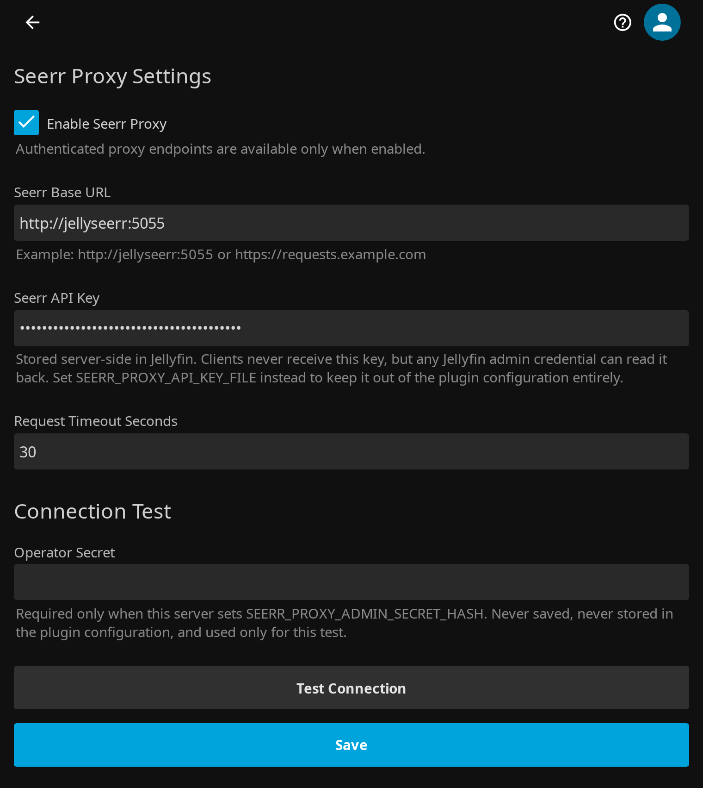

<p align="center">
  
</p>

# jellyfin-plugin-seerr-proxy

<p align="center">
  <a href="https://github.com/voc0der/jellyfin-plugin-seerr-proxy/releases/latest">
    
  </a>
  <a href="https://github.com/voc0der/jellyfin-plugin-seerr-proxy/tree/main/tests">
    
  </a>
  <a href="https://github.com/voc0der/jellyfin-plugin-seerr-proxy/actions/workflows/codeql.yml">
    
  </a>
  <a href="https://github.com/voc0der/jellyfin-plugin-seerr-proxy/issues">
    
  </a>
  <a href="LICENSE">
    
  </a>
</p>

`jellyfin-plugin-seerr-proxy` is a minimal Jellyfin plugin that lets authenticated Jellyfin clients use a safe subset of the Seerr API as the currently logged-in Jellyfin user.

The plugin keeps Seerr credentials on the Jellyfin server. A client such as Wholphin calls the Jellyfin plugin endpoint with its normal Jellyfin auth token; the plugin resolves that Jellyfin user to the linked Seerr user and forwards allowlisted Seerr API calls with `X-API-User` set server-side.

<p align="center">
  
</p>
<p align="center">
  <em>Configuration page inside the Jellyfin dashboard</em>
</p>

## What It Does

- Exposes authenticated Jellyfin endpoints under `/Plugins/SeerrProxy`.
- Resolves the current Jellyfin user from Jellyfin authentication claims.
- Looks up the linked Seerr user with `GET /api/v1/user/jellyfin/{jellyfinUserId}`.
- Proxies allowlisted Seerr API calls for linked Jellyfin users.
- Sends `X-Api-Key` and `X-API-User` only from server-side plugin configuration and resolved identity.
- Returns clear JSON errors suitable for TV clients.

## What It Does Not Do

- It does not create Jellyfin libraries.
- It does not create placeholder media.
- It does not sync discovery content.
- It does not hook favorites or watch state.
- It does not change the Jellyfin library experience.

## Required Seerr Setup

- Configure Seerr connection string in the Jellyfin plugin settings and give Jellyfin Seerr's API key.
- Jellyfin users must already be imported or linked in Seerr. The plugin does not create or link Seerr users.

## Endpoints

All endpoints require Jellyfin authentication.

### `GET /Plugins/SeerrProxy/Status`

Returns plugin state and, when configured and enabled, whether the current Jellyfin user maps to a Seerr user. Secrets are never returned.

### `/Plugins/SeerrProxy/api/v1/{path}`

Allowlisted passthrough for clients that need Seerr data or requests without storing Seerr credentials locally. The plugin forwards these requests to Seerr's `/api/v1/{path}` with `X-Api-Key` and `X-API-User` set server-side.

Supported methods and route families:

- `GET auth/me`
- `GET settings/public`
- `GET search`
- `GET discover/...`
- `GET movie/{id}`, `movie/{id}/recommendations`, `movie/{id}/similar`, `movie/{id}/ratings`
- `GET tv/{id}`, `tv/{id}/recommendations`, `tv/{id}/similar`, `tv/{id}/ratings`, `tv/{id}/season/{season}`
- `GET person/{id}`, `person/{id}/combined_credits`
- `GET request`, `GET request/{id}`
- `POST request`
- `PUT request/{id}`
- `DELETE request/{id}`

Client-provided identity fields and authentication headers are ignored, and this is enforced rather than merely documented: inbound headers are never copied to the outbound request, and `userId`, `user`, `requestedBy`, and `modifiedBy` are stripped from the top level of every forwarded body. The plugin derives the requester from Jellyfin authentication only.

Requests are rate limited to 120 per Jellyfin user per minute, and bodies larger than 256 KiB are refused with 413.

### `POST /Plugins/SeerrProxy/Test`

Dashboard-only elevated endpoint used by the configuration page to test Seerr reachability and the configured API key. Rate limited to 30 requests per minute server-wide, and gated by the operator secret when one is configured.

## Security

Full detail in [docs/SECURITY.md](docs/SECURITY.md). The short version:

- A Jellyfin **API key is not a user** and can never proxy — only a real authenticated user can. This matters because Jellyfin 10.11.x grants every API key the `Administrator` role.
- The Seerr API key can be supplied by the **environment** instead of plugin configuration, so it never enters Jellyfin's config XML and can never be read back through the plugin configuration endpoint.
- The elevated `Test` endpoint can be gated by a second, **operator-held secret** that the plugin only ever stores as a SHA-256 hash.
- Forwarded paths are **allowlisted** and cannot escape Seerr's `/api/v1/` root; redirects are never followed, so the API key cannot be carried to another host.

### Environment variables

All optional. None are `JELLYFIN_`-prefixed on purpose: Jellyfin logs the value of every `JELLYFIN_`, `DOTNET_`, and `ASPNETCORE_` variable at startup.

| Variable | Purpose |
| --- | --- |
| `SEERR_PROXY_API_KEY_FILE` | Path to a file holding the Seerr API key. Preferred. |
| `SEERR_PROXY_API_KEY` | The Seerr API key itself. |
| `SEERR_PROXY_ADMIN_SECRET_HASH_FILE` | Path to a file holding the operator secret hash. Preferred. |
| `SEERR_PROXY_ADMIN_SECRET_HASH` | Hex-encoded `SHA-256` of the operator secret. |
| `SEERR_PROXY_REQUIRE_ADMIN_SECRET` | Set to `1` to make the operator secret mandatory rather than opt-in. |

The file form wins when both forms of a value are set, and an environment-supplied API key wins over one stored in plugin configuration.

On a trusted machine, generate the operator secret and its hash:

```bash
SECRET="$(openssl rand -base64 32 | tr '+/' '-_' | tr -d '=')"
HASH="$(printf '%s' "$SECRET" | sha256sum | awk '{print $1}')"
printf 'Operator secret (keep for the caller): %s\n' "$SECRET"
printf 'Operator hash   (give Jellyfin):       %s\n' "$HASH"
```

Give the hash to Jellyfin and keep the secret for whatever calls the elevated endpoint:

```yaml
services:
  jellyfin:
    environment:
      SEERR_PROXY_ADMIN_SECRET_HASH_FILE: /run/secrets/seerr-proxy-hash
    volumes:
      - ./seerr-proxy-hash:/run/secrets/seerr-proxy-hash:ro
```

## Installation

### Plugin Catalog

1. Open **Dashboard -> Plugins -> Repositories**
2. Add `https://raw.githubusercontent.com/voc0der/jellyfin-plugin-seerr-proxy/main/manifest.json`
3. Install **Seerr Proxy** from **Catalog**
4. Restart Jellyfin

### Manual Install

1. Download the latest ZIP from the releases page
2. Extract it into your Jellyfin plugins directory
3. Restart Jellyfin

## Build Manually
See [CONTRIBUTING.md](CONTRIBUTING.md) for development information.
